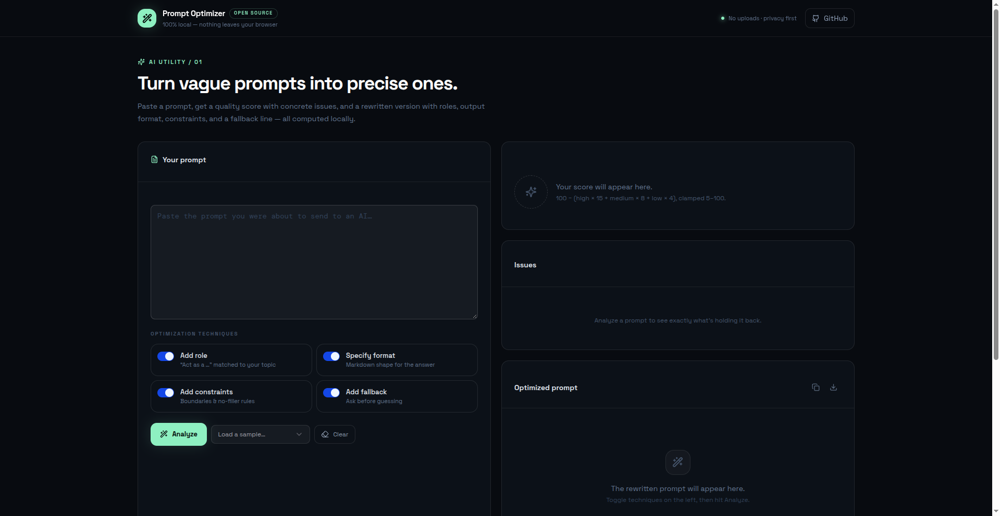
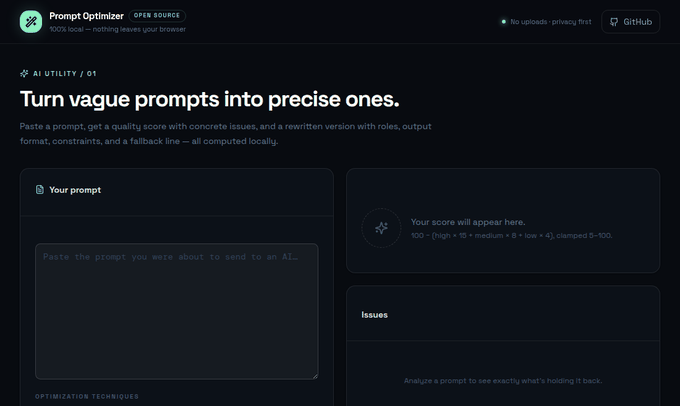

# Prompt Optimizer

Turn vague prompts into precise ones — a local-first workbench that scores your prompt, explains every issue, and rewrites it with proven techniques.

**Live demo:** https://devilking7x.github.io/prompt-optimizer/

## ✨ Features

- **Quality score (0–100)** — eight local heuristics detect missing roles, vague wording, absent output format, missing constraints, rambling length, question overload, missing fallbacks, and context-free long prompts.
- **Issue breakdown** — every issue lists severity (high / medium / low), why it matters, and exactly how to fix it.
- **One-click rewrite** — toggle techniques (Add role, Specify format, Add constraints, Add fallback) and get an optimized prompt with domain detection (code → expert software engineer, writing → writing coach, data → data analyst).
- **Optimized | Diff tabs** — see the rewrite side-by-side with a line-by-line diff.
- **Sample prompts** — vague coding, vague writing, decent, and rambling examples to try instantly.
- **Local history** — last 20 analyses stored in your browser; click to reload, delete per item.
- **Copy & download** — copy the optimized prompt or download it as Markdown.
- **100% private** — everything runs in your browser tab. No uploads, no API keys, no tracking.


### ❤️ Bada Dil, Chhoti Madad
Ye tool free hai aur hamesha free rahega. Agar isne tumhara time ya paisa bachaya ho, to ek Star ⭐ de do.
[⭐ Star this repo](https://github.com/devilking7x/prompt-optimizer)

## 🧮 How the scoring works

```
score = 100 − (high × 15 + medium × 8 + low × 4), clamped to 5–100
```

| Rule | Severity |
|---|---|
| No role (`you are` / `as a` / `act as`) | high |
| No output format (`json`, `markdown`, `table`, …) | high |
| Vague words (`good`, `some`, `various`, `etc`, `things`, `stuff`) | medium |
| No constraints (`must`, `avoid`, `only`, `exactly`, …) | medium |
| Under 15 words | medium |
| More than 2 question marks | medium |
| Over 400 words (rambling) | low |
| No fallback (`if unsure…`, `ask me…`) | low |
| Long but no context/examples | low |

## 🚀 Quick start

```bash
pnpm install
pnpm dev
```

Build for production:

```bash
pnpm build
```

## 🔒 Privacy

Prompts never leave your browser. History lives in `localStorage` under `prompt-optimizer:history:v1` and can be cleared anytime from the UI.

## 📸 Screenshots





## ❓ FAQ

**Is my prompt sent to any server?**
No. Scoring and rewriting happen 100% in your browser. Nothing is uploaded anywhere.

**How is the score calculated?**
Eight local heuristics check for things like a missing role, vague wording, no output format, and missing constraints. See "How the scoring works" above for details.

**Does it actually give better answers from AI models?**
It turns vague prompts into specific, structured ones — and specific prompts consistently get better responses from models like ChatGPT and Claude.

**Where is my history stored?**
In your browser's localStorage, on your device only. Clear your browser data and it's gone.

## 📄 License

MIT — see [LICENSE](LICENSE).
